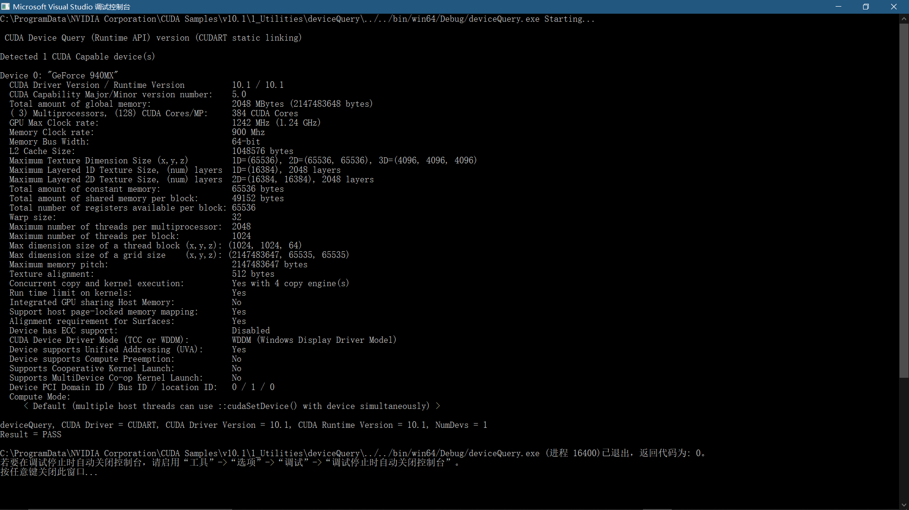
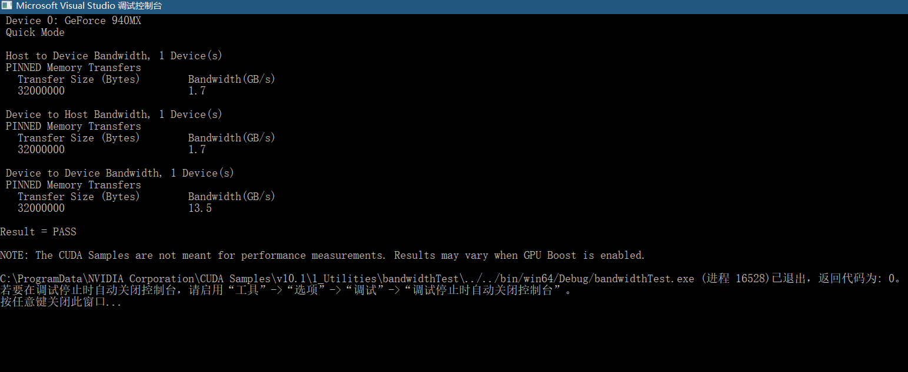

### 2.4 使用一个合适的驱动模式

在Window 7以上系统中，操作系统给NVIDIA 的驱动提供了两种模式：

- WDDM驱动模式，给显示设备使用
- Tesla Computer Cluster(TCC)模式，给非显示设备使用，适应场景是比如远程桌面。TCC可以减少CUDA kernel 启动的延迟。

对于 NVIDIA Tesla CPUs，TCC模式是默认开启的。可以使用 `nvidia-smi`工具来使用或切换驱动的模式。（`nvidia-smi -h `可以查看给命令具体信息）

[官方](https://docs.nvidia.com/cuda/cuda-installation-guide-microsoft-windows/index.html)注：`NVIDIA GeForce GPUs (excluding GeForce GTX Titan GPUs) do not support TCC mode.`（所以我一个GeForce 940MX辣鸡根本不用关心这些……）

### 2.5 验证安装

在该目录（具体还得看自己安装的版本号，我的是v10.1)：（`C:\ProgramData\`可能是一个隐藏文件夹）。

```
C:\ProgramData\NVIDIA Corporation\CUDA Samples\v10.1\1_Utilities\deviceQuery
```

选择一个适合自己电脑VS版本的.sln文件，打开然后运行。如果出现下面结果，显示了Device 设备找到（第三行），则表示安装 CUDA Toolkit 成功了。



再运行`bandwidthTes`程序（该`C:\ProgramData\NVIDIA Corporation\CUDA Samples\v10.1\1_Utilities\`目录下），再次验证 CUDA 设备能够正确地进行通信。

