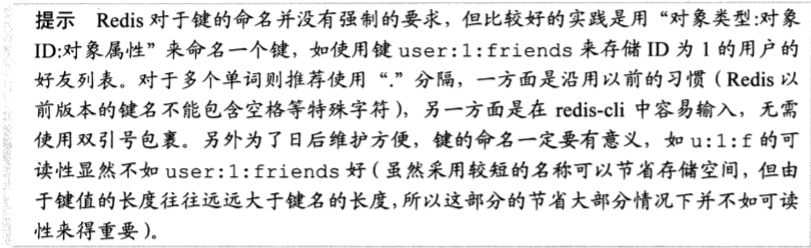

# 云计算

17341155   计算机科学与技术（大数据、人工智能方向）  王永康 

# 本课程的重要知识点

1. 云计算是什么？

   > 云计算是分布式计算的一种特殊形式，它引入效用模型来远程供给可扩展和可测量的资源

2. 云计算有哪些基本特性（云特性）？

   > - 按需使用On-demand usage
   >   - 云用户可以自助、单边访问云资源，无需云提供者介入
   >   - 基于服务的特性和使用驱动的特性均由“按需使用”促成
   >   - 技术要点：资源动态分配与回收
   >
   > - 随处访问Ubiquitous usage
   >   - 需要支持一组设备、传输协议、接口和安全技术
   >   - 技术要点：接口标准的制定、多协议支持
   >
   > - 多租户Multitenancy (and Resource Pooling)
   >   - 多个云用户共享软件和实例
   >   - 可以根据云服务用户的需求动态分配IT资源
   >   - 技术要点：虚拟化、隔离性
   >     - 性能隔离（比如分网络带宽，CPU的可用性）、安全隔离
   >
   > - 弹性Elasticity
   >
   >   - 自动、透明地提供IT资源的能力
   >
   >   - 是“降低成本”、“成比例使用”这些特性的基础
   >
   > - 可测量的使用Measured Usage
   >
   > - 可恢复性Resiliency
   >
   >   - 是一种故障转移（Failover）的形式
   >
   >   - 在多个物理位置分放IT资源的冗余实现
   >
   >     - **Active-Active**：同时提供服务，两台服务器都同时工作
   >
   >     - **Active-Standby**：主备模式，只有一个提供服务，另外一台做备份
   >
   >     - **虚拟机迁移**：若存储服务可用，可将虚拟机迁移重启

3. 云交付模型有哪些？

   >- 基础设施作为服务 (IaaS，Infrastructure as a Service)
   >
   >- 平台作为服务 (PaaS，Platform as a Service)
   >- 软件作为服务 (SaaS，Software as a Service)

4. 云部署模型有哪些？

   > - 公有云Public Cloud
   >   - 由第三方云提供者拥有的可公共访问的云环境
   >
   > - 社区云Community Cloud
   >   - 类似于公有云，但它的访问被限制为特定的云用户社区
   >
   > - 私有云Private Cloud
   >
   >   - 一家组织自己独有的云环境
   >
   >   - 该组织既是云提供者，也是云用户
   >
   > - 混合云Hybrid Cloud
   >
   >   - 不同部署模型的混合

5. SDN是什么？

   > **软件定义网络（SDN，Software Defined Network）**
   >
   > - SDN是一种新型的网络技术，它将网络的控制与数据转发进行分离，网络智能地被抽取到一个集中式的控制器中，数据流的接入、路由等都由控制器来控制，而**交换机只是按控制器所设定的规则进行数据分组的转发**，最终通过开放可编程的软件模式来实现网络的自动化控制功能

6. 什么是虚拟化技术？

   > - 虚拟化是指将**物理IT资源**转换为**虚拟IT资源**的过程
   >
   > - 大多数IT资源都能被虚拟化，包括：
   >
   >   - 服务器：一个物理服务器可以抽象为多个虚拟服务器
   >
   >   - 存储设备：一个物理存储设备可以抽象为一个虚拟存储设备或一个虚拟磁盘
   >
   >   - 网络：物理路由器和交换机可以抽象为逻辑网络，如VLAN
   >
   >   - 电源：一个物理UPS和电源分配单元可以抽象为通常意义上的虚拟UPS

7. 网络虚拟化的几个层次？

   >- 虚拟机的虚拟网卡
   >  - 解决单台物理机上多个虚拟机之间共享网卡的问题
   >
   >- 服务器到网络的连接：虚拟交换机
   >  - 解决单台物理机上多个虚拟机之间数据交换的问题
   >
   >- 交换设备虚拟化
   >  - 解决多个交换设备之间的冗余/隔离问题
   >
   >- 虚拟网络
   >  - 解决数据中心中网络划域的问题

8. 虚拟机迁移是什么？

   > **虚拟机迁移**是将虚拟机从**一个物理主机**迁移到**另一个物理主机上**的过程。

9. 虚拟机迁移的分类有哪些？

   > - 离线迁移：关闭虚拟机，将其持久状态迁到其它物理主机上
   >
   > - 在线迁移：虚拟机在运行过程中不停机迁移

10. 经典的大规模云存储系统有哪些实现？

    > - 分布式文件存储系统：
    >   - Google文件系统GFS
    >   - 淘宝文件系统TFS
    >   - Facebook的文件系统Haystack
    > - 分布式键值存储系统：
    >   - Dynamo分布式键值存储
    > - 分布式表格系统：
    >   - Bigtable

# Redis 学习

## 简介

Redis 是一个开源的高性能键值对数据库。通过它提供的多种键值数据类型，可以满足不同应用场景下的需求。

### 多元数据库

Redis 是一个**字典结构**的存储服务器，实际上一个 Redis 实例提供了多个用来存储数据的字典，客户端可以指定将数据库存储在哪个字典中。

这种字典形式的存储结构与常见的 MySQL 等**关系数据库**的二维表形式的存储结构有很大的差异。它非常适合存储半结构化的数据，比如程序中使用存储一件商品的信息，那么首先是商品的名字, 商品的价格，以及商品的标签。然而一个商品的标签往往都是可以有很多，而且不同的商品的标签数量可能不同，所以此时如果使用 MySQL 这个关系数据库，那么可以就需要使用多个二维表才能很好的表示这种数据。然而如果使用 Redis 那么只需要存储一个 key 为商品名，value 可以是一个散列类型，存储后面所有的信息。

另外，Redis 的每个数据库对外都是一个从 0 开始的递增数字命名， Redis 默认支持 16 个数据库，可以通过配置参数 databases 来修改这一数字。可以使用 SELECT 命令来更换数据库.

每个数据库都以编号命名，不支持自定义的数据库名字。另外，Redis 也不支持为每个数据库也没有权限访问，要么全访问，要么一个都不可以访问。多个数据库之间并不是完全隔离的，比如 FLUSHALL 命令可以清空 Redis 实例中所有的数据库中的数据。 

### 内存存储与持久化

与其他数据库不同的是，它的所有数据都存储在内存中。因为内存的读写速度远远快于磁盘，所以 Redis 在性能上对其他基于硬盘的数据库有非常明显的优势。也正是它读写速度块的特点，在很多高并发的大型业务中，缓存信息都会存在 Redis 中。

不过，将数据存储在内存中也有相应的问题，会因为程序的退出而丢失数据。不过，Redis 提供了对持久化的支持，即可以将内存中的数据异步写入到磁盘中，同时不影响提供服务。

另外，Redis 还提供了一些比较丰富的功能，比如给每个键设置 TTL，生存时间到期后键会自动被删除。这一功能具有非常大的实战价值，比如在分布式的情形下，利用 Redis 设置分布式锁就利用到了键值的生存期这一特性。

### Redis 的启动

先在 Linux 下安装 Redis, 在命令行下和 Redis 交互。

启动 Redis 的服务器：[]表示[]内的语句可以省略，是一个可选参数。

```bash
redis-server [--port 6379]
```

进入交互界面（另开一个终端）

```bash
redis-cli [command]
```

## 基本数据类型

### 1. 字符串类型

字符串类型是 Redis 中最基本的数据类型。它没有直接使用 C 语言传统的字符串表示（以空字符串作为结尾），而是自己构建一种名为简单动态字符串（simple dynamic string, SDS）的抽象类型，并将 SDS 用作 Redis 的默认字符串表示。在 Redis 里面，C 字符串只会作为字符串字面量用在一些无须对字符串值进行修改的地方，比如打印日志。

一些基本的操作

- 赋值和取值

  ```Redis
  SET key value
  GET key
  ```

- 递增数字

  ```Redis
  INCR key
  ```

- 命令拾遗：

  - INCRBY key increment
  - DECR key
  - DECRBY key decrement
  - INCRBYFLOAT key increment 增加浮点数

- 向尾部追加值

  - APPEND key value, 如果键不存在，则将键的值设置为value, 返回追加后字符串的总长度。

    双引号区分空格；

- 获取字符串的长度

- STRLEN key, 不存在返回0。这里的长度是指 UTF-8 编码在的长度；

- 同时获得/设置多个键值：

  - MGET key [key ...]
  - MSET key value [key value ...]

- 位操作：

  - GETBIT key offset

  - SETBIT key offset value

  - BITCOUNT key [start] [end] (字节)，获取是1的二进制位个数

  - BITOP operation destkey key [key ...]，

    eg: BITOP OR res foo1 foo2

> 命名规则：
>
> 

### SDS 的实现

它的数据结构如下：

```C++
struct sdshdr{
    int len; // 表示 SDS 字符串的长度
    int free; // buf 数组未使用字节的数量
    char buf[]; // 字符数组，保存字符串
}
```

使用该数据结构其实有点像 Go 的 slice 类型，都是这样的设计思想。这样设计有几个好处：

- 避免内存泄漏。C 字符串因为依靠 `\0` 字符串结尾的特点，而不检查字符串本身所占内存，所以容易造成内存泄漏，缓冲区溢出，比如函数 `char *strcat(char *dest, const char *src)` ，如果 dest 没有分配足够多的内存，那么就会产生缓冲区溢出的问题。
- 可以 O(1) 时间获取字符串的长度。
- 修改增加字符串的长度时，设计相应的内存分配策略，一般可以提升效率：
  - 空间预分配
    - 可以预先分配比所需存储的字符串更大的空间，即 buf 的内存字节数比 len 值大。
  - 惰性空间释放
    - 比如截取某个字符串，根据 free 值的大小，释放一些内存。

### 2. 散列类型

散列类型（hash）的键值也是一种字典结构，其存储了字段（field) 和字段值的映射，但字段值只能是字符串，不支持其他数据类型，即散列类型不能嵌套其他数据类型。一个散列数据类型键可以包含至多 $2^{31}-1$ 个字段。

散列类型时候存储对象：使用对象类别和 ID 构成键名，字段表示对象的属性，而字段值则存储属性值。

> 优点：
>
> - 关系数据库中存储这种半结构化的数据需要额外的表才行；
> - 然而，Redis 的散列则不存在这个问题，对于每个对象的存储结构，可以不一样。

#### 命令

1. **赋值和取值**

   这些命令应该很好记，也很好理解：

   ```Redis
   HSET key field value
   HGET key field
   HMSET key field value [field value ...]
   HMGET key field [field ...]
   HGETALL key
   ```

2. 判断字段是否存在: 存在返回 1， 否则返回 0，键值不存在也会返回 0 。

   ```Redis
   HEXISTS key field
   ```

3. 当字段不存在时赋值

   ```Redis
   HSETNX key field value
   ```

   与 HSET 命令类似，区别于如果字段已经存在，HSETNX 命令将不执行任何操作；

4. 增加数字

   ```Redis
   HINCRBY key field increment
   ```

5. 删除字段

   ```Redis
   HDEL key field [field ...]
   ```

### 3. 列表类型

列表类型（list）可以存储一个有序的字符串列表，常用的操作是向列表两端添加元素，活着获得列表的某一个片段。

列表类型内部是使用双向链表（double linked list）实现的。好处：可以快速的访问头尾的一些元素，加入新元素不影响之前的，但代价是索引访问可能会慢。适用场景：社交网站的新鲜事。适合用来记录日志。

一个列表类型键，最多容纳 $2^{32}-1$个元素。

### 命令

1. 向列表两端增加元素

   ```Redis
   LPUSH key value [value ...] // 向左加入
   RPUSH key value [value ...] // 向右加入
   ```

2. 从列表两端弹出元素

   ```Redis
   LPOP numbers	// 列表左边弹出一个元素：移除元素，并返回移除的元素
   RPOP numbers	// 列表右边弹出一个元素
   ```

3. 获取列表中元素的个数

   ```Redis
   LLEN key //这个操作的复杂度为O(1)
   ```

4. 获得列表片段

   ```Redis
   lrange key start stop //注意包含最右端的元素，即stop包含
   ```

   支持负索引，表示从右边开始计数；

   - 如果 start 索引的位置比 stop 索引位置靠后，则会返回空列表
   - 如果是 stop 大于实际的索引范围，则会返回到列表最右边的元素；

5. 删除列表中指定的值

   ```Redis
   lrem key  count value
   ```

   命令会删除列表中前 count  个值为 value 的元素，返回值是实际删除的元素个数。

   - 当 count >0 时，lrem 命令会删除前count 个值为 value 的元素
   - count < 0时，lrem 命令会从列表右边开始删除前 |count | 个值为 value 的元素。

美中不足的是：

- 没有类似字符串那样的 MGET 命令，每次访问一个键，都要向数据库请求一次，产生一次往返时延，**不过可以利用管道和脚本优化这个问题**。

命令拾遗

1. 获得/设置指定索引的元素值。

   ```Redis
   lindex key index  //获得键 key 对应的 index 索引的值
   lset key index value
   ```

2. 只保留列表指定片段

   删除指定索引范围之外的所有元素，包含最右边元素。

   ```Redis
   ltrim key start end
   ```

3. 向列表中插入元素

   ```Redis
   linsert key before|after pivot value
   ```

   首先，会在列表中从左到右查找到值为 pivot 的元素，然后根据第二个参数  before or after 来决定将 value 插入到后面还是前面。

4. 将元素从一个列表转移到另一个列表

   ```Redis
   rpoplpush source destination
   ```

   把列表类型作为队列使用时，rpoplpush 命令可以很直观地在多个队列中传递数据。如果source 和 destination 相同时，那么可以不断把队尾的元素移动到队首。

### 3. 集合类型

集合中每个元素都是不同的，且没有顺序。一个集合类型（set）键可以存储至多 $2^{31}-1$ 个字符串。

常用操作是向集合中加入或删除元素、判断某个元素是否存在等等。集合类型在 Redis 内部是使用值为空的散列表 ( hash table) 实现的，所以这些操作的时间复杂度都是 O(1)。

#### 命令

1. 增加/删除元素

   ```Redis
   sadd key member [member ...]
   srem key member [member ...]
   ```

   第一条是增加元素，返回值是成功加入的元素数量。

   第二条是删除元素，返回值是成功删除的元素数量。

2. 获得集合中的所有元素

   ```Redis
   smembers key
   ```

3. 判断元素是否在集合中

   ```Redis
   sismember key member
   ```

   存在时，返回1；否则，返回0。

4. 集合间的运算

   ```Redis
   sdiff key [key ...]
   sinter key [key ...]
   sunion key [key ...]
   ```

   1. sdiff 命令用来对多个集合执行差集运算。集合 A 和集合 B 的差集表示为 A-B，代表所有属于 A 且不属于 B 的元素的构成。
   2. sinter 执行多个集合的交集运算。
   3. sunion 命令用来对多个集合执行并集运算。

5. 命令拾遗：

   1. 获得集合中的元素个数:

   ```Redis
   scard key
   ```

   2. 集合运算存入键

   ```Redis
   sdiffstore destination key [key ...]
   sinterstore destination key [key ...]
   sunionstore destination key [key ...]
   
   ```

   3. 随机获得集和中的元素

   ```Redis
   srandmember key [count]
   ```

   随机获取\|count\|个元素，count省略时，默认返回一个。

   - count > 0, 随机返回 count 个不同的元素
   - count < 0, 随机返回 \|count\|个元素，可能相同；

   4. 从集合中弹出一个元素

      ```Redis
      spop key
      ```

      随机弹出一个元素。

### 4. 有序集合类型

sorted set。

在集合类型的基础上有序集合类型为集合中的每个元素都关联了一个分数。

有序集合和列表类型的区别：

- 列表类型是通过链表实现的，获取接近两端的数据速度极快
- 有序集合类型是使用散列表和跳跃表实现的，所以即使读取之间部分的数据速度也很快（复杂度是O(logN)
- 列表不能简单得调整某个元素的位置，但是有序集合可以（通过改这个元素的分数）。
- 有序集合要比列表类型更耗费内存。

#### 命令

1. 增加元素

   ```Redis
   zadd key score member [score member]
   ```

分数不仅可以是整数，也支持双精度浮点数；+inf，-inf也可以

2. 获得元素的分数

   ```Redis
   zscore key member
   ```

3. 获得排名在某个范围的元素列表

   ```Redis
   zrange key start stop [withscores]
   zrevrange key start stop [withscores]
   ```

   zrange 命令会按照元素分数从小到大的顺序返回索引从start 到 stop 之间所有元素。

   zrevrange从大到小；

4. 获得指定分数范围的元素

   ```Redis
   zrangebyscore key min max [withscores] [limit offset count]
   ```

5. 增加某个元素的分数

   ```Redis
   zincrby key increment member
   ```

#### 命令拾遗

1. 获得集合中元素的数量

   ```Redis
   zcard key
   ```

2. 获得指定分数范围内的元素个数

   ```Redis
   zcount key min max
   ```

3. 删除一个或多个元素

   ```Redis
   zrem key member [member ...]
   ```

   返回值是成功删除的元素数量。

4. 按照排名范围删除元素

   ```Redis
   zremrangebyrank key start stop
   ```

   `zremrangebyrank` 命令按照元素分数从小到大的顺序删除处在指定排名范围内的所有元素，并返回删除是元素数量。

5. 按照分数范围删除元素

   ```Redis
   zremrangebyscore key min max
   ```

   返回的是删除的元素数量。

6. 获得元素的排名

   ```Redis
   zrank key member
   zrevrank key member
   ```

   从 0 开始，即最小的排名为 0。

7. 计算有序集合的交集

   ```Redis
   zinterstore destination numkeys key [key ...] [weights weight [weight ...]] [aggregate sum|min|max ]
   ```

   返回值为 destination 键中的元素个数。


## 结束语

由于时间紧张和篇幅限制，Redis 的初步学习大概如此。然后学完初步认识之后，我在想 Redis 和之前所学的 MySQL 到底有何不同，为什么它能够取得广泛的运用？原因大概如下：

随着互联网的发展，各种智能终端的兴起，用户数量的极具增加，现在很多互联网业务场景，服务器都要承受来自客户端的秒级大量访问，比如很常见的秒杀系统：购物节时网上抢购等等。

在这样一种场景下，服务器以方面要承受高并发的大量访问，如果只是使用一台机器来处理请求，往往会因压力过大无法快速处理所有请求，甚至宕机造成单点失效的严重问题。在实际解决中，往往会引入服务器集群来处理请求。一般通过代理服务器把来自客户端的请求负载均衡地分发到服务器集群中。这就涉及到分布式情形下很多问题了，最常见的是需要保证服务器集群的数据一致性。而 Redis 本身它就提供了对 Redis 集群功能的支持，运用类似 Raft 协议的主从复制算法，**Redis 可以保证不同主机之间数据的一致性**。也正是这个特点，使得 Redis 在保证分布式业务下数据一致性使用非常常见。

**另一个原因是速度**。服务器需要对用户的访问做出快速的响应。而传统的 MySQL 等关系型数据库，因为其自身设计，查询或修改数据库本身需要花费的时间代价（需要读写磁盘，磁盘I/O是比网络I/O 慢很多的）是远远满足不了这种快速响应的系统的。而 Redis 由于数据存在内存，读写都是非常迅速，所以很多场景下为了提供服务器的响应速度，会把数据直接先缓存在 Redis，用户端来访问时都是直接读取来自 Redis 的数据，而不是去读取磁盘。

总之，Redis 因为其自身的优点，在当下许多业务场景中发挥了不可比拟的作用。学习这种工业领域应用广泛的技术具有很强的实际意义！


## 参考

[1] 黄健宏.《Redis设计与实现》[M]. 北京: 机械工业出版社. 2014.4

[2] 李子骅.《Redis入门指南》[M]. 北京：人民邮电出版社. 2013.5